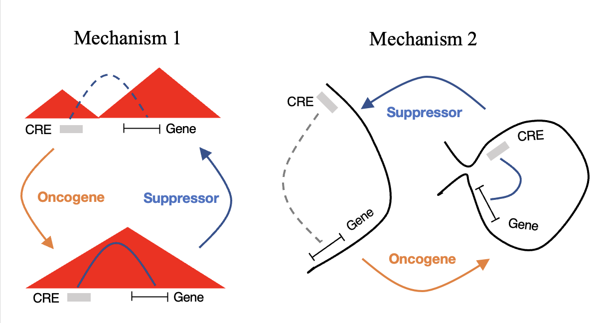

# Inter3d:  A ready-to-use pipeline for CTCF-mediated interactome identification with 3D genomics and high-throughput sequencing
-------------

## Data required
- samples/cells of two or more conditions.
- RNA-seq,  HiC and CTCF ChIP-seq, ATAC-seq or DNase-seq required.
- H3K4me3 and H3K27ac ChIP-seq. (optional)

## Inter3d biology mechanism

## Inter3d workflow
- **Before Inter3d**
1. Preprocessing RNA-seq
- Mapping and gene quantification. (not included)
- DEG identification.(not included)
2. Preprocessing ChIP-seq and ATAC-seq
- Mapping to reference genome.(not included)
- Consensus peak calling.(not included)  
3. Preprocessing Hi-C.

** We recommend using ENCODE uniform processing pipeline for your raw data preprocessing. [https://www.encodeproject.org/pipelines/](https://www.encodeproject.org/pipelines/)

- **Using Inter3d**
4. Identify CTCF-mediated TAD alterations.
5. Identify candidate genes regulated by CTCF binding.
6. Find Enhancer-Promoter pairs regulated by CTCF binding.

## Inter3d quick guide
- Input files:
  - DEG list with Log2FoldChange of Case1/Case2
  - ATAC-seq/DNase-seq peaks in Case1 and Case2 
  - CTCF ChIP-seq peaks in Case1 and Case2 
  - Genome-wide TAD boundary of Case1 and Case2

- Output files:
  - Genome coordinates of candidate enhancers and linked promoters.
  - Genome coordinates of candidate CTCF binding sites.
